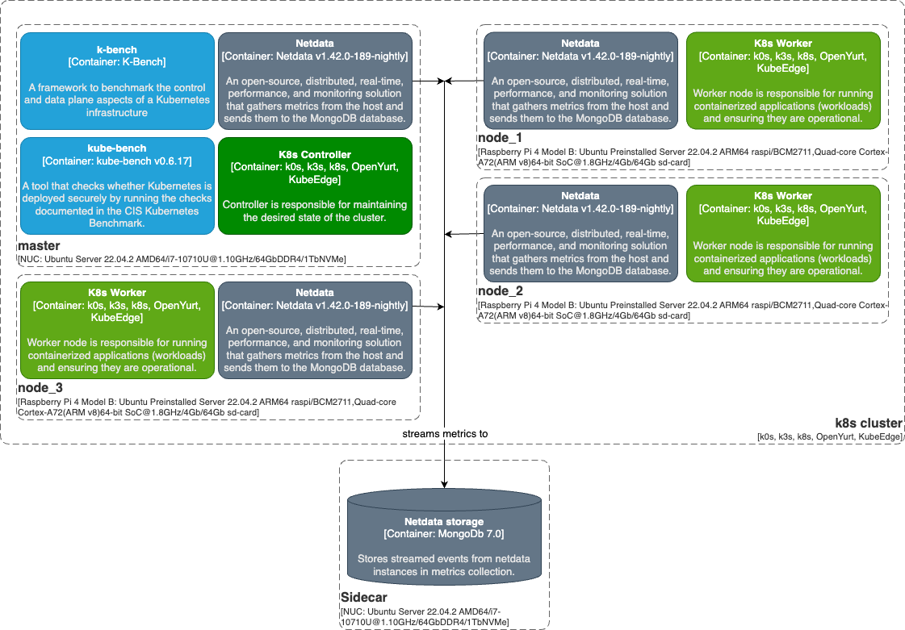
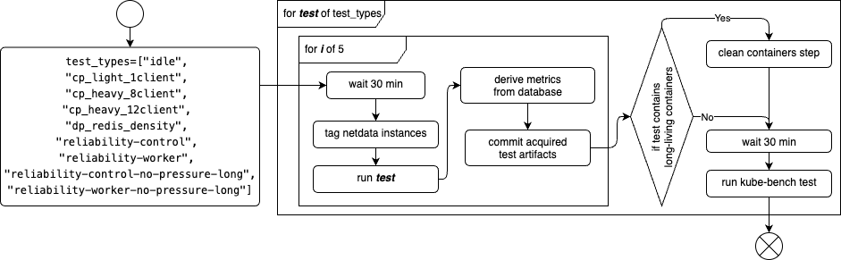

# iot-edge
[GenerIoT - Generating and Deploying Lightweight, Secure and Zero-overhead Software for Multipurpose IoT Devices](https://itea4.org/project/generiot.html)

## Contents
* [Local Development](./LOCAL-DEV.md)
* [Change log](./CHANGE-LOG.md)

## Overview
The diagram below shows the high-level architecture of the test system.  

The tests were conducted according to the following diagram:

# License
This project is licensed under the MIT License - see the [LICENSE](./LICENSE) file for details.

